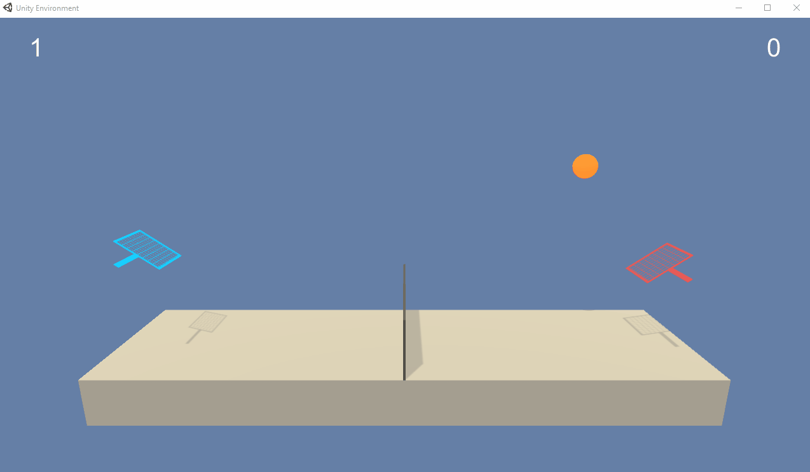

# Collaboration and Competition: Multi Agent Deep Deterministic Policy Gradient

The repository provides an implementation of a Multi Agent Deep Deterministic Policy Gradient algorithm to solve the 
unity Tennis problem.
There are two agents playing tennis. Each agent receives a positive reward of +0.1 if the ball hits over the net while he receives
a negative reward of 0.01 if he misses or the ball is out of bounds. Hence, this environment can be considered as collaborative 
since both agents try to keep the ball in the game as long as possible.
Each actor receives a state vector of 24 observations and can perform two continuous actions ranging from -1 to 1.
The environment is solved if an average score of 0.5 over hundred consecutive games is reached, 
where average is defined as the average of the maximum score of the agents in each game.
  
 

## Installation
Clone the github repo
- git clone https://github.com/ChristianH1984/multi_agent_ddpg
- cd multi_agent_ddpg
- conda env create --name multi_agent_ddpg --file=environment.yml
- activate multi_agent_ddpg
- open Report.ipynb and enjoy exiting tennis matches
